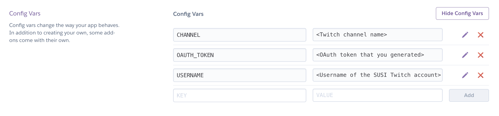
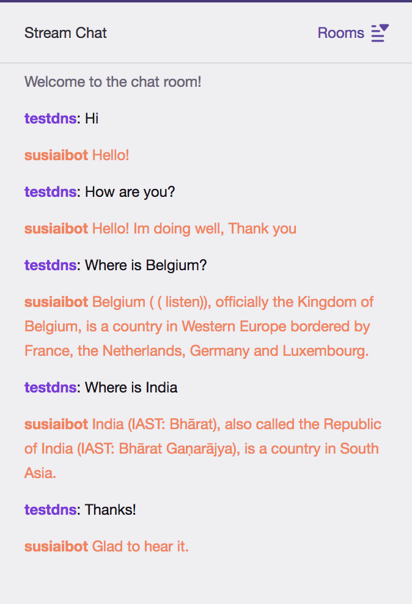

# Deploying SUSI AI Twitch Bot on Heroku

## Requirements:

* [Heroku](https://www.heroku.com/) Account
* [Twitch](https://www.twitch.tv) Account

## Steps:

1. Fork this repository.
2. Create a [twitch account](https://www.twitch.tv) that will act as the SUSI AI bot and will reply to queries.
3. Go to http://twitchapps.com/tmi, click on "Connect with Twitch" and login to the account that will be used as SUSI AI bot. This will generate an OAuth token. Save it for later use.
4. Go to [Heroku](https://www.heroku.com/). Create an account or log in if you already have an account.
5. Now, you will be talking to SUSI AI on a Twitch channel. So for that you need an account different than the one you created for SUSI just now. Create this account(if you don't have one already) and save the channel name (username) of this account as well for later use.
6. Create a new app on [Heroku dashboard](https://dashboard.heroku.com/).
7. Go to settings and add these config vars "CHANNEL", "OAUTH_TOKEN", "USERNAME" and "HEROKU_URL".
* The key of "CHANNEL" is the channel name on which you'd like to talk to SUSI.
* The key of "OAUTH_TOKEN" is the OAuth key that you generated earlier. (Remember to include "oauth:" in the key)
* The key of "USERNAME" is the username of the Twitch account you created for SUSI AI.
* The key of "HEROKU_URL" is "http://<your_app_name>.herokuapp.com" (write 'http' and not 'https').  

	
8. Now go to Deploy and connect with GitHub in Deployment method.
9. Choose the forked repository of SUSI AI Twitch bot in your account.
10. Enable automatic deploys and deploy the bot.

Congratulations! Now your SUSI AI Twitch bot is deployed on Heorku. Go to your Twitch channel and have fun talking to SUSI!

